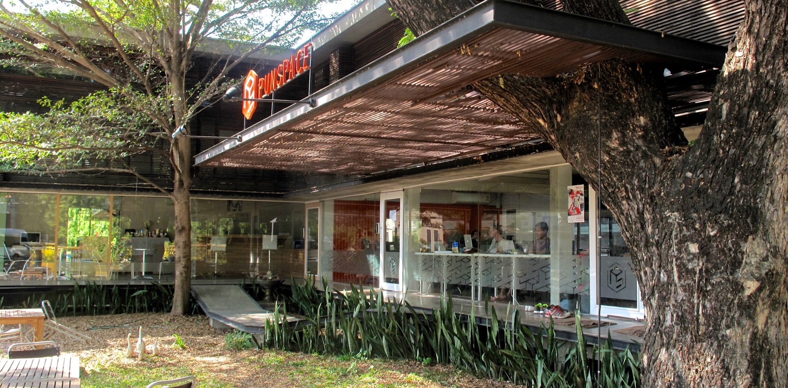
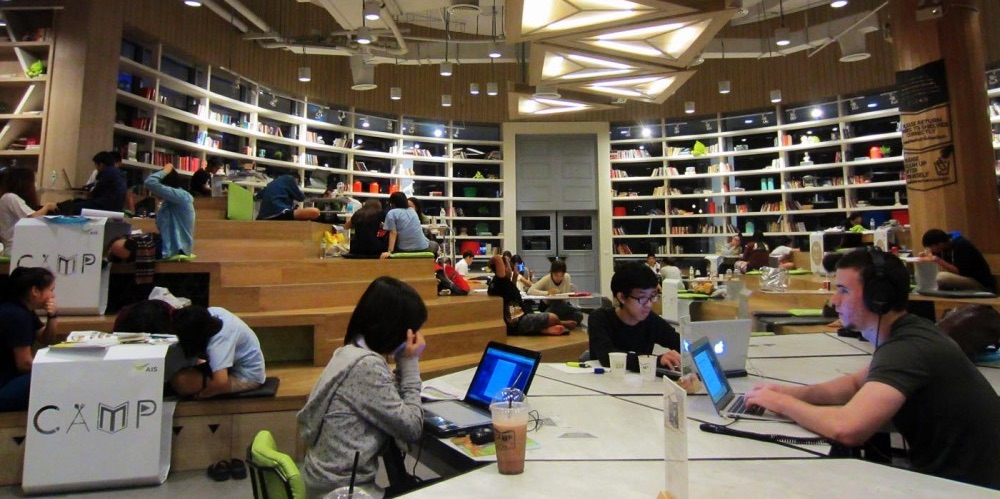
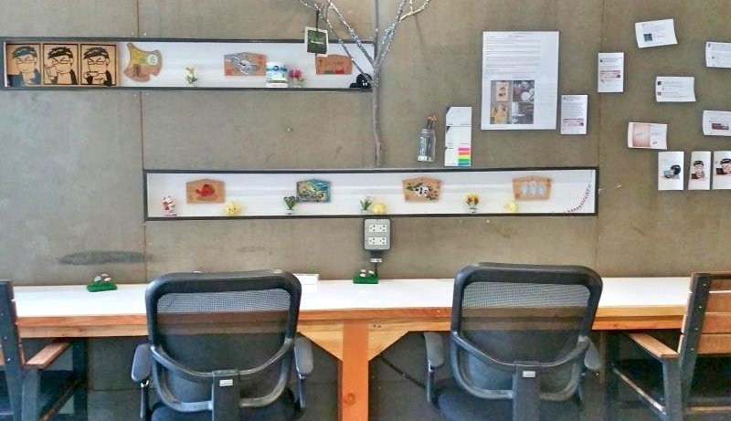

## Intro

I've had a pleasure of working from quite a few coworking spaces, since I started working remotely. In my opinion this is the best way for keeping you socially active and in the same time maintaining necessary focus to fulfill day to day responsibilities.

_Chiang Mai_ which is quite famous for being unofficial capital of remote workers and so called _digital nomads_ is definitely a great city to explore potential of living in Thailand.

Here's my opinion on some of the coworking spaces in Chiang Mai.

## Punspace (Nimman)

This was the first coworking space, I've visited in Chiang Mai. This place seemed very convenient, since it was within walking distance from my apartment. Initially, I got a 10 days flex pass which allows access to the open space from 9am till 6pm for 2199THB. To my disappointment this turned out to be a poor choice. Due to growing popularity of Punspace - sometimes it was impossible to find a free chair in the open space area. Additionally internet connection was definitely not up for the task of long calls. For this reason, I think value for money - comparing to other places, could've been better.

_Price_: $$ (225THB/day)

_Noise_: 4/10

_Internet_: Poor (below 10MB/s)

_Skype rooms_: 1

## Punspace (Tha Phae Gate)

Second Punspace is located near the center of Old Town. This area is mostly packed with tourists, so not many people decide to work from here. Unlike the other place you can easily find a free comfortable chair. I've only been there couple of times, but each time I've enjoyed calm and work-friendly atmosphere.

_Price_: $$ (225THB/day)

_Noise_: 2/10

_Internet_: Good (about 20MB/s)

_Skype rooms_: 3

## C.A.M.P. (Maya shopping mall)

One of my favorite spots in Nimman. It's located on the top floor of Maya shopping center.
Convenient location and abundance of great food makes this place almost perfect.
On the downside during afternoon hours it's usually filled with students trying to do their homework, so don't expect it to be peaceful and quiet all the time.

_Price_: $ (150THB/month - AIS Super WiFi)

_Noise_: 7/10

_Internet_: Great (above 100MB/s up and down)

_Skype rooms_: 0

## Mana

Last but not least, Mana. It's one of the smallest offices I've visited - only seats about 8 people. However it's very unlikely to be filled - I've been there on various occasions and never had a problem finding a spot. If you prefer to rent only for a few hours, it's convenient and cheap (19THB/h). Iced water and great hot tea provided as a bonus!

_Price_: $ (99THB/day)

_Noise_: 3/10

_Internet_: Poor (below 10MB/s)

_Skype rooms_: 2

### Epilogue

I wasn't very keen on working from cafes at the beginning of my adventure as _digital nomad_. However this form of workspace environment has grown on me significantly. I'll probably do a second post just with list of best cafes to work from in _Chiang Mai_.